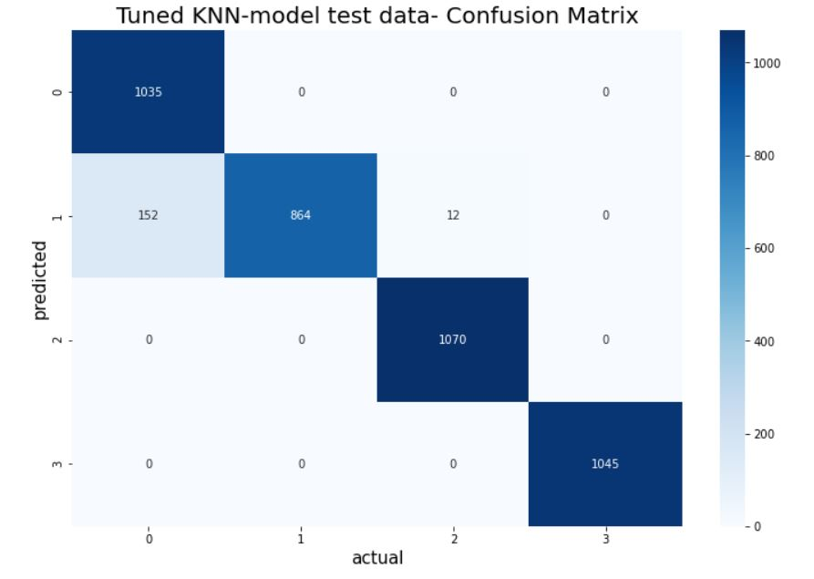

# Hypothyroidism
Medical classification of hypothyroidism
 
### About the project-
   The dataset contains features like patient's age, TSH measure, whether the patient in on thyropxine etc. using these features we are predicting the functioning of the patients thyroid condition. different algorithms like Logistic regression,K-neighbours,Random forest etc to predict the patient's thyroid condition.
### Python Packages used- Pandas,Imblearn, NumPy, Scipy, Scikit-Learn, Seaborn and Matplotlib.
### Final results-

